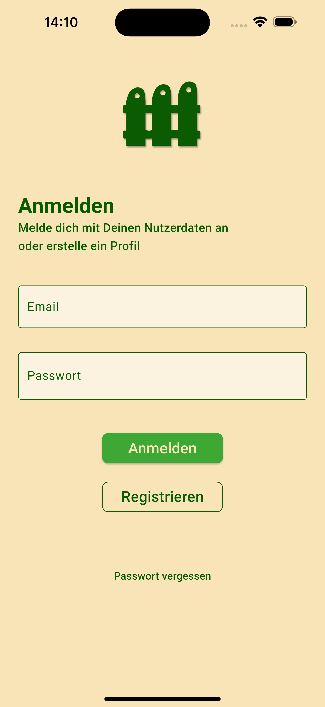

# Zaunfunk das Kleingartennetzwerk

Eine App die innerhalb von Kleingartenvereinen, für Bekanntmachungen, zur Abgabe ungenutzer Dinge, Hilfegesuche sowie Hilfeangebote dienen soll. Oder einfach nur um sich mit Mitgliedern zu vernetzen, die man sonst dort nicht antreffen würde. Diese App habe ich neben meiner Weiterbildung zum Quereinstieg als App Entwickler, von Konzeption und Desing bis hin zum Backend, selbst entwickelt.

## Login

  

## App

  
 

